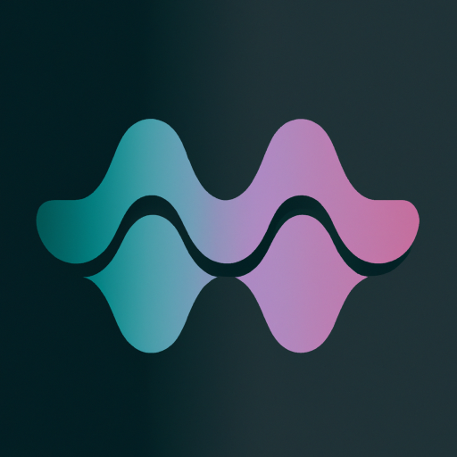
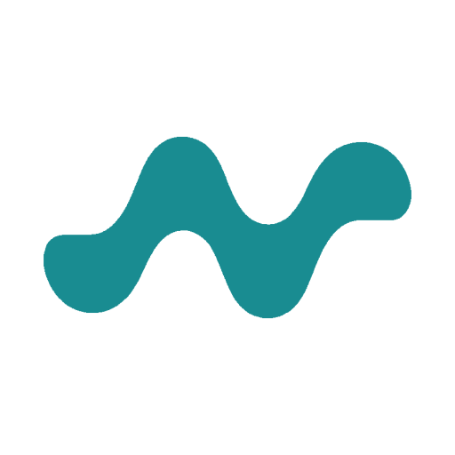
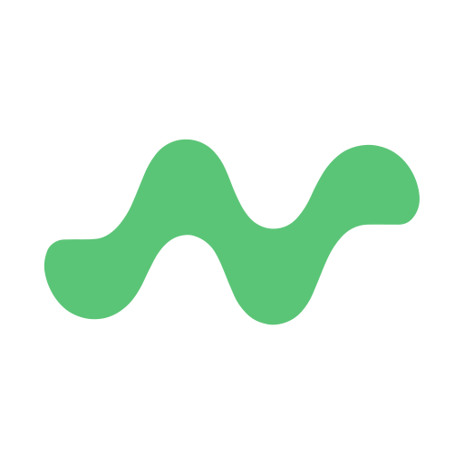

# OpenCE

English version below.

[Zur Zusammenfassung](brand.md)

## Wie habt ihr das Logo erstellt?

### Schritt 1: Logo generiert mit KI

Wir haben [IconifyAI](https://www.iconifyai.com/) benutzt, um viele unterschiedliche Icons bzw. Logos zu generieren.

### Schritt 2: Nachbearbeitung

Uns hat die Form der Sinus-Welle am meisten gefallen. Aber wir wollten ein noch schlichteres Logo ohne Farbverlauf. Wir haben [GIMP](https://www.gimp.org/) benutzt, um das generierte Logo so zu bearbeiten, wie es uns am besten gefällt.

### Schritt 3: Farben

Wir haben [poolors](https://poolors.com/314545-5bc577) und [Huemint](https://huemint.com/website-1/#palette=f3f2f1-314545-5bc577) benutzt um eine Farbpalette zu erzeugen.

60% / Primary: #f3f2f1  

30% / Secondary: #314545  

10% / Accent: #5bc577  

### Schritt 4: PNG zu SVG

Bisher war das Logo die ganze Zeit im PNG Format. Damit wir ein skalierbares Logo bekommen, haben wir [Vectorizer.AI](https://vectorizer.ai/) benutzt, um das Logo zu vektorisieren.

---
Translated with [DeepL](https://www.deepl.com/translator)

[Overview](brand.md)

## How did you create the logo?

### Step 1: AI generated logo

We used [IconifyAI](https://www.iconifyai.com/) to generate many different icons / logos.

### Step 2: Postprocessing

We liked the shape of the sine wave the most. But we wanted an even simpler logo without a gradient. We used [GIMP](https://www.gimp.org/) to edit the generated logo the way we like it best.

### Step 3: Colors

We used [poolors](https://poolors.com/314545-5bc577) and [Huemint](https://huemint.com/website-1/#palette=f3f2f1-314545-5bc577) to create a color palette.

60% / Primary: #f3f2f1  

30% / Secondary: #314545  

10% / Accent: #5bc577  

### Step 4: PNG to SVG

So far, the logo has been in PNG format all along. To get a scalable logo, we used [Vectorizer.AI](https://vectorizer.ai/) to vectorize the logo.

